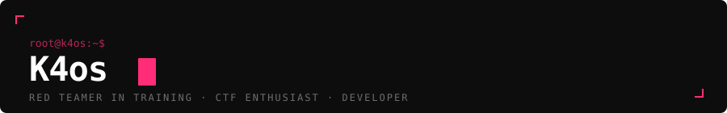

<div align="center">



</div>

<br>

```
Ethical hacking isn't about breaking things. It's about understanding them well enough to.
```

<br>

---

### / whoami

I'm a cybersecurity student working my way through penetration testing — methodically, one box at a time. I compete in CTFs to sharpen what I learn, and I document everything worth documenting in my repositories.

No filler. No fluff. Just the work.

---

### / current_missions

<br>

**`CPTS — Certified Penetration Testing Specialist`** &nbsp;·&nbsp; HackTheBox Academy


<br>

**`Python`** &nbsp;·&nbsp; freeCodeCamp


<sub>Started recently — this one's the long game.</sub>

<br>

---

### / tools_&_interests

```bash
focus      →  Penetration Testing  |  CTF Competitions
learning   →  CPTS (HTB)  |  Python  |  Offensive Security
mindset    →  break to understand  |  document everything
```

---

### / find_me

[](https://linkedin.com/in/k4os)
[](https://app.hackthebox.com/profile/k4os)
[](https://tryhackme.com/p/k4os)

---

### / stats

<div align="center">


</div>

<br>

<div align="right">
<sub><code>// more repos incoming</code></sub>
</div>
